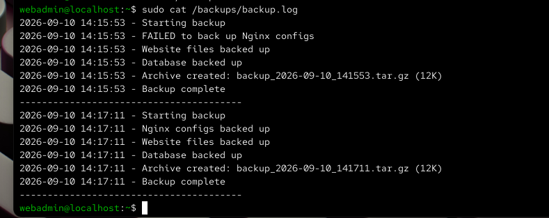
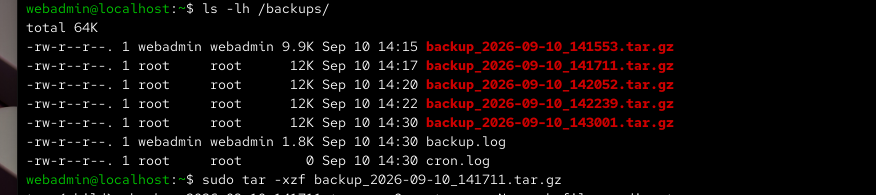
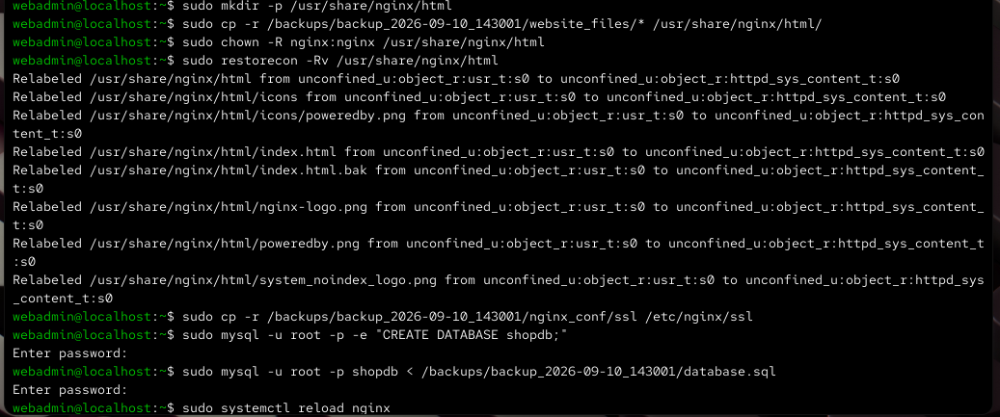
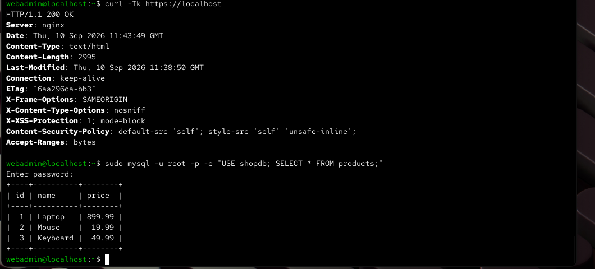
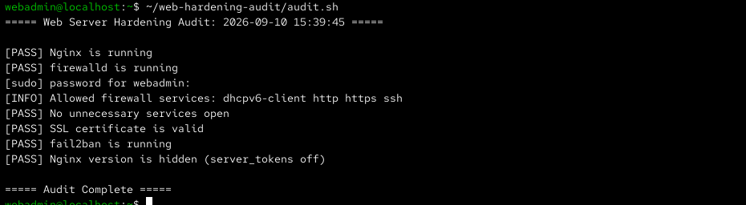

# Build a Secure & Resilient Web Infrastructure (Nginx, firewalld, MariaDB)

This is a self-directed lab project where I built a production-style web server from the ground up. Instead of just installing software, I focused on the full lifecycle: **Deployment → Hardening → Verification → Backup → Recovery**. 

The goal was to practice "defense-in-depth"—making the server difficult to break into and impossible to permanently lose.

## 🛠 The Stack
- **OS:** RHEL 10
- **Web Server:** Nginx
- **Database:** MariaDB
- **Firewall:** firewalld (Least-Privilege)
- **TLS:** OpenSSL (Self-signed)
- **Intrusion Prevention:** fail2ban
- **Automation:** Bash, Cron

---

## 🔒 Phase 1: Server Hardening
I wanted this server to be as invisible as possible to attackers.

### Firewall Lockdown
I stripped `firewalld` down to the bare essentials. I removed default services like Cockpit and NFS, leaving only `ssh`, `http`, `https`, and `dhcpv6-client` open.

### Nginx & Security
- **Version Hiding:** Disabled `server_tokens` so the server doesn't advertise its version in the headers.
- **Security Headers:** Added `X-Frame-Options`, `X-Content-Type-Options`, `X-XSS-Protection`, and `CSP` to protect against common web attacks.
- **Encryption:** Generated a 2048-bit RSA certificate and forced all port 80 traffic to redirect to HTTPS. I locked the server to TLS 1.2 and 1.3, disabling all weak ciphers.

### Brute-Force Protection
I configured `fail2ban` to monitor both SSH and Nginx logs. If any IP fails to authenticate 5 times within 10 minutes, it gets automatically banned for one hour.

---

## 🛡️ Phase 2: Resilience & Recovery
Security is pointless if you lose your data. I built a custom automation suite to ensure the system can be restored in minutes.

### Automated Backup System
I wrote a Bash script (`Config_Files/backup.sh`) that handles the heavy lifting:
- **What is backed up:** Nginx configs, SSL certificates, website files, and a full `mysqldump` of the MariaDB database.
- **How it works:** It creates a compressed, timestamped `.tar.gz` archive.
- **Rotation:** To save space, the script automatically deletes backups older than 7 days.
- **Scheduling:** I set up a **cron job** to trigger this every day at 2:00 AM.

### The "Stress Test" (Disaster Recovery)
To prove the backups actually worked, I simulated a total system failure:
1. I deleted the live website files and SSL certificates.
2. I dropped the entire MariaDB database.
3. I restored everything from the latest archive, correcting the file ownership and SELinux contexts.

**Result:** The site came back online immediately with all data and encryption intact.

---

## ✅ Phase 3: Verification & Auditing
I didn't want to guess if the security was working, so I wrote `Config_Files/audit.sh`. This script automatically checks:
- If Nginx, firewalld, and fail2ban are active.
- If only the approved firewall ports are open.
- If the SSL certificate is valid.
- If the Nginx version is successfully hidden.

It outputs a clear **PASS/FAIL** report for every single check.

## 📂 Project Matrial
You can find the full Matrial of this project in the following folders:
- `/Screenshots`: Before/after recovery shots and audit results.
- `/Config_Files`: The actual configuration files used for the hardening.
